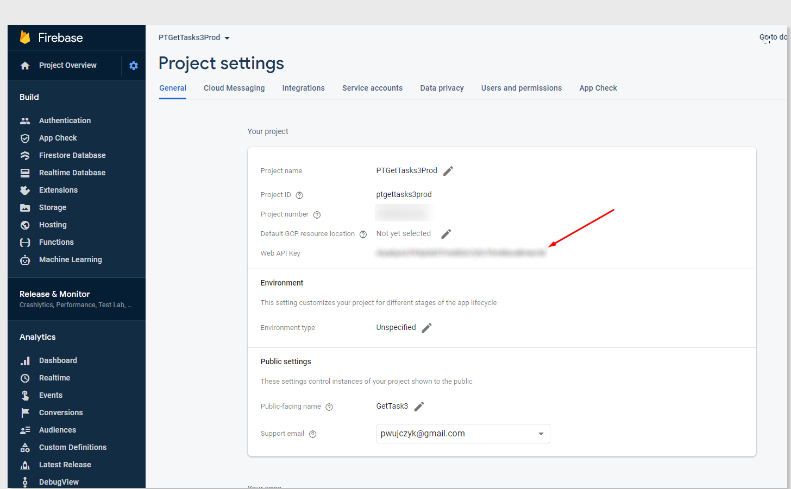

<!--Category:PowerShell--> 
 <p align="right">
    <a href="https://www.nuget.org/packages/ProductivityTools.ConnectionStringLight/"></a>
    <a href="http://productivitytools.tech/get-servicedescription/"><a> 
    <a href="https://github.com/ProductivityTools-Tasks3/ProductivityTools.GetTask3.Sdk"></a>
</p>
<p align="center">
    <a href="http://http://productivitytools.tech/">
        
    </a>
</p>

# GetTask3.Sdk

GetTask3.Sdk provides a .NET client for accessing the GetTask3 API. It handles authentication via Firebase and provides strongly-typed methods for interacting with tasks.

## Configuration

The SDK requires two main configurations to work:

1.  **API Address**: The address of the GetTask3 server API.
2.  **Firebase Web API Key**: Required for exchanging custom tokens for ID tokens.
3.  **Google Application Credentials**:
    *   **In the Cloud (GCP)**: The service account is automatically detected.
    *   **Local Development**: You need a Firebase service account key JSON file (e.g., `ptprojectsweb-firebase-adminsdk.json`). The file must be placed in the project folder, and the `GOOGLE_APPLICATION_CREDENTIALS` environment variable must be set to point to it.

The SDK initializes the Firebase App internally using:

```csharp
FirebaseApp.Create(new AppOptions()
{
    Credential = GoogleCredential.GetApplicationDefault(),
});
```

### Obtaining Credentials

For local development, the service account file can be downloaded from the Firebase Console:


You also need the **Firebase Web API Key** (used in `TaskClient` constructor):



## Usage

Initialize the `TaskClient` with the API URL, your Web API Key, and a logging action:

```csharp
string apiUrl = "http://localhost:5513/api/"; // or production URL
string webApiKey = "YOUR_FIREBASE_WEB_API_KEY";

var taskClient = new TaskClient(apiUrl, webApiKey, (logMessage) => { 
    System.Console.WriteLine($"[SDK Log]: {logMessage}"); 
});
```

### Methods

The SDK currently exposes the following methods:

*   **GetStructure**
    *   `Task<ElementView> GetStructure(int? currentNode, string path)`
    *   Retrieves the task structure for a given node or path (e.g., today's list).

*   **Start**
    *   `Task<object> Start(int elementId, Action<string> log)`
    *   Starts a specific task by its Element ID.

*   **GetThisWeekFinished**
    *   `Task<ElementView> GetThisWeekFinished(int? currentNode, string path)`
    *   Retrieves the list of tasks finished this week.

*   **GetThisWeekFinishedForUser**
    *   `Task<ElementView> GetThisWeekFinishedForUser(int? currentNode, string path, string userEmail)`
    *   Retrieves the list of tasks finished this week for a specific user.

*   **GetLast7DaysFinishedForUser**
    *   `Task<ElementView> GetLast7DaysFinishedForUser(int? currentNode, string path, string userEmail)`
    *   Retrieves the list of tasks finished in the last 7 days for a specific user.

## Authorization Flow

The SDK performs the following internal authorization steps:
1.  Uses the Service Account (`GOOGLE_APPLICATION_CREDENTIALS`) to create a **Custom Token** via `FirebaseAdmin`.
2.  Exchanges the Custom Token for a Firebase **ID Token** by calling the Google Identity Toolkit API (`https://identitytoolkit.googleapis.com/v1/accounts:signInWithCustomToken`).
3.  Uses the ID Token as a Bearer token for all requests to the GetTask3 API.

- We perform a call from service to https://apigettask3.productivitytools.top:8040/api/CustomToken/Get